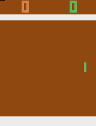

# Advanced Machin Learning Project: DQN and Policy Gradient Models for Pong

This repository is for a final project Deep reinforcement learning with pixel features for the course Advanced Machine Learning (GR5242) • Fall 2018 at Columbia University

## Requirements

- tensorflow-gpu
- gym
- gym[atari]
- imageio

## DQN

The first note book is code for DQN, you can turn on TEST_MODE for testing and producing gif, if you have the trained model in coressponding path. Those gifs are for the Double Dueling DQN model Wang, Z. (2015) and awjuliani. (2017), as we can see, different model produce very similar strategy.




As promised in our report, we can also test same model with PongNoFrameskip-v4, because gif's fps restriction, the gif will be slower.


## Policy Gradient

The second notebook corresponding to Policy Gradient model, which consists of four parts as below.

1. Construct Policy network and define functions for saving and reloading models during training
2. Set up logging directory
3. Set up parameters, which can be further experimented with
4. Training the Policy network and save training results and videos

The notebook is for training under Pong-v0 environment. In order to reproduce similar result under PongDeterministic-v4 environment, change the line of environment setting to: 

`env = gym.make('PongDeterministic-v4')`

and run all the kernels sequentially.

The trained agent under original Pong-v0 environmnet receives an average reward of +6 after 2 days of training on a Macbook Pro until 22,000 episodes, and receices a full reward of +21 after 5 hours of training on a Macbook Pro unitil 5,000 episodes.


Following [suggestions](http://nicercode.github.io/blog/2013-04-05-projects/) by [RICH FITZJOHN](http://nicercode.github.io/about/#Team) (@richfitz). This folder is orgarnized as follows.

```
proj/
├── lib/
├── data/
├── doc/
├── figs/
└── output/
```

Please see each subfolder for a README file.

